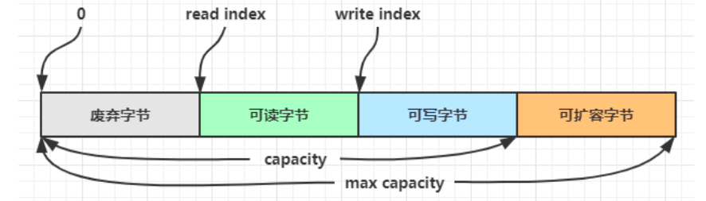
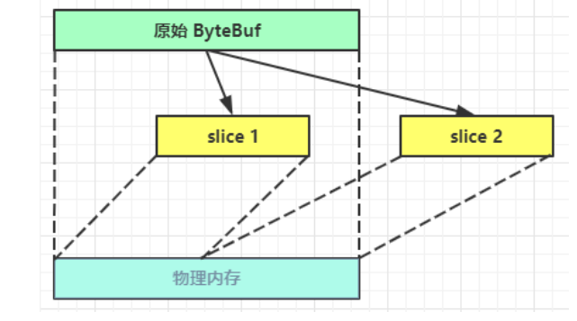
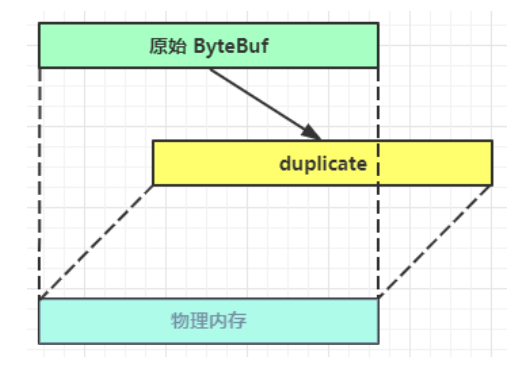

# ByteBuf

ByteBuf是对字节数据的封装


## ByteBuf创建

```java
package mao.t1;

import io.netty.buffer.ByteBuf;
import io.netty.buffer.ByteBufAllocator;
import lombok.extern.slf4j.Slf4j;

import static io.netty.buffer.ByteBufUtil.appendPrettyHexDump;
import static io.netty.util.internal.StringUtil.NEWLINE;

/**
 * Project name(项目名称)：Netty_ByteBuf
 * Package(包名): mao.t1
 * Class(类名): ByteBufTest
 * Author(作者）: mao
 * Author QQ：1296193245
 * GitHub：https://github.com/maomao124/
 * Date(创建日期)： 2023/3/20
 * Time(创建时间)： 21:26
 * Version(版本): 1.0
 * Description(描述)： ByteBuf创建
 */

@Slf4j
public class ByteBufTest
{
    public static void main(String[] args)
    {
        //创建一个ByteBuf
        ByteBuf byteBuf = ByteBufAllocator.DEFAULT.buffer();
        log.info(byteBuf.toString());
        //创建一个ByteBuf，初始容量为20（cap）
        byteBuf = ByteBufAllocator.DEFAULT.buffer(20);
        log.info(byteBuf.toString());
    }
}
```


运行结果：

```sh
2023-03-20  21:30:27.447  [main] INFO  mao.t1.ByteBufTest:  PooledUnsafeDirectByteBuf(ridx: 0, widx: 0, cap: 256)
2023-03-20  21:30:27.447  [main] INFO  mao.t1.ByteBufTest:  PooledUnsafeDirectByteBuf(ridx: 0, widx: 0, cap: 20)
```


## 直接内存和堆内存

可以使用下面的代码来创建池化基于堆的 ByteBuf

```java
ByteBuf buffer = ByteBufAllocator.DEFAULT.heapBuffer();
```


也可以使用下面的代码来创建池化基于直接内存的 ByteBuf

```java
ByteBuf buffer = ByteBufAllocator.DEFAULT.directBuffer();
```

* 直接内存创建和销毁的代价昂贵，但读写性能高（少一次内存复制），适合配合池化功能一起用
* 直接内存对 GC 压力小，因为这部分内存不受 JVM 垃圾回收的管理，但也要注意及时主动释放


```java
package mao.t2;

import io.netty.buffer.ByteBuf;
import io.netty.buffer.ByteBufAllocator;
import lombok.extern.slf4j.Slf4j;

/**
 * Project name(项目名称)：Netty_ByteBuf
 * Package(包名): mao.t2
 * Class(类名): ByteBufTest
 * Author(作者）: mao
 * Author QQ：1296193245
 * GitHub：https://github.com/maomao124/
 * Date(创建日期)： 2023/3/20
 * Time(创建时间)： 21:38
 * Version(版本): 1.0
 * Description(描述)： 直接内存和堆内存
 */

@Slf4j
public class ByteBufTest
{
    public static void main(String[] args)
    {
        //基于堆的 ByteBuf
        ByteBuf byteBuf = ByteBufAllocator.DEFAULT.heapBuffer();
        log.info(byteBuf.toString());
        //释放
        boolean release = byteBuf.release();
        log.debug(String.valueOf(release));
        //基于直接内存的 ByteBuf
        byteBuf = ByteBufAllocator.DEFAULT.directBuffer();
        log.info(byteBuf.toString());
        //释放
        release = byteBuf.release();
        log.debug(String.valueOf(release));
        //默认ByteBuf
        byteBuf = ByteBufAllocator.DEFAULT.buffer();
        log.info(byteBuf.toString());
        //释放
        release = byteBuf.release();
        log.debug(String.valueOf(release));

        //基于堆的 ByteBuf，容量为32
        byteBuf = ByteBufAllocator.DEFAULT.heapBuffer(32);
        log.info(byteBuf.toString());
        //释放
        release = byteBuf.release();
        log.debug(String.valueOf(release));
        //基于直接内存的 ByteBuf，容量为64
        byteBuf = ByteBufAllocator.DEFAULT.directBuffer(64);
        log.info(byteBuf.toString());
        //释放
        release = byteBuf.release();
        log.debug(String.valueOf(release));
    }
}
```


运行结果：

```sh
2023-03-20  21:45:41.028  [main] INFO  mao.t2.ByteBufTest:  PooledUnsafeHeapByteBuf(ridx: 0, widx: 0, cap: 256)
2023-03-20  21:45:41.028  [main] DEBUG mao.t2.ByteBufTest:  true
2023-03-20  21:45:41.032  [main] INFO  mao.t2.ByteBufTest:  PooledUnsafeDirectByteBuf(ridx: 0, widx: 0, cap: 256)
2023-03-20  21:45:41.032  [main] DEBUG mao.t2.ByteBufTest:  true
2023-03-20  21:45:41.032  [main] INFO  mao.t2.ByteBufTest:  PooledUnsafeDirectByteBuf(ridx: 0, widx: 0, cap: 256)
2023-03-20  21:45:41.032  [main] DEBUG mao.t2.ByteBufTest:  true
2023-03-20  21:45:41.032  [main] INFO  mao.t2.ByteBufTest:  PooledUnsafeHeapByteBuf(ridx: 0, widx: 0, cap: 32)
2023-03-20  21:45:41.032  [main] DEBUG mao.t2.ByteBufTest:  true
2023-03-20  21:45:41.032  [main] INFO  mao.t2.ByteBufTest:  PooledUnsafeDirectByteBuf(ridx: 0, widx: 0, cap: 64)
2023-03-20  21:45:41.032  [main] DEBUG mao.t2.ByteBufTest:  true
```


## 池化和非池化

池化的最大意义在于可以重用 ByteBuf，优点有

* 没有池化，则每次都得创建新的 ByteBuf 实例，这个操作对直接内存代价昂贵，就算是堆内存，也会增加 GC 压力
* 有了池化，则可以重用池中 ByteBuf 实例，并且采用了与 jemalloc 类似的内存分配算法提升分配效率
* 高并发时，池化功能更节约内存，减少内存溢出的可能


池化功能是否开启，可以通过下面的系统环境变量来设置

```java
-Dio.netty.allocator.type={unpooled|pooled}
```

* 4.1 以后，非 Android 平台默认启用池化实现，Android 平台启用非池化实现
* 4.1 之前，池化功能还不成熟，默认是非池化实现


## 组成

ByteBuf 由四部分组成




最开始读写指针都在 0 位置


## 写入


|                           方法签名                           |          含义          |                    备注                     |
| :----------------------------------------------------------: | :--------------------: | :-----------------------------------------: |
|                 writeBoolean(boolean value)                  |    写入 boolean 值     |      用一字节 01\|00 代表 true\|false       |
|                     writeByte(int value)                     |      写入 byte 值      |                                             |
|                    writeShort(int value)                     |     写入 short 值      |                                             |
|                     writeInt(int value)                      |      写入 int 值       |  Big Endian，即 0x250，写入后 00 00 02 50   |
|                    writeIntLE(int value)                     |      写入 int 值       | Little Endian，即 0x250，写入后 50 02 00 00 |
|                    writeLong(long value)                     |      写入 long 值      |                                             |
|                     writeChar(int value)                     |      写入 char 值      |                                             |
|                   writeFloat(float value)                    |     写入 float 值      |                                             |
|                  writeDouble(double value)                   |     写入 double 值     |                                             |
|                   writeBytes(ByteBuf src)                    | 写入 netty 的 ByteBuf  |                                             |
|                    writeBytes(byte[] src)                    |      写入 byte[]       |                                             |
|                  writeBytes(ByteBuffer src)                  | 写入 nio 的 ByteBuffer |                                             |
| int writeCharSequence(CharSequence sequence, Charset charset) |       写入字符串       |                                             |


* 这些方法的未指明返回值的，其返回值都是 ByteBuf，意味着可以链式调用
* 网络传输，默认习惯是 Big Endian


```java
package mao.t3;

import io.netty.buffer.ByteBuf;
import io.netty.buffer.ByteBufAllocator;
import lombok.extern.slf4j.Slf4j;
import mao.utils.ByteBufUtils;

import java.nio.charset.StandardCharsets;

/**
 * Project name(项目名称)：Netty_ByteBuf
 * Package(包名): mao.t3
 * Class(类名): ByteBufTest
 * Author(作者）: mao
 * Author QQ：1296193245
 * GitHub：https://github.com/maomao124/
 * Date(创建日期)： 2023/3/22
 * Time(创建时间)： 14:23
 * Version(版本): 1.0
 * Description(描述)： 写入
 */

@Slf4j
public class ByteBufTest
{
    public static void main(String[] args)
    {
        //创建一个16字节的ByteBuf
        ByteBuf buffer = ByteBufAllocator.DEFAULT.buffer(16);
        //写入数据
        buffer.writeBoolean(false);
        //打印
        ByteBufUtils.debug(buffer);
        //写入数据
        buffer.writeBoolean(true);
        //打印
        ByteBufUtils.debug(buffer);

        System.out.println("\n\n");

        //创建一个16字节的ByteBuf
        buffer = ByteBufAllocator.DEFAULT.buffer(16);
        //写入数据
        buffer.writeByte(0x22);
        //打印
        ByteBufUtils.debug(buffer);
        //写入数据
        buffer.writeByte(66);
        //打印
        ByteBufUtils.debug(buffer);

        System.out.println("\n\n");

        //创建一个16字节的ByteBuf
        buffer = ByteBufAllocator.DEFAULT.buffer(16);
        //写入数据
        buffer.writeShort(0x6943);
        //打印
        ByteBufUtils.debug(buffer);

        System.out.println("\n\n");

        //创建一个16字节的ByteBuf
        buffer = ByteBufAllocator.DEFAULT.buffer(16);
        //写入数据
        buffer.writeInt(0x6946);
        //打印
        ByteBufUtils.debug(buffer);
        //写入数据，大端模式
        buffer.writeIntLE(0x4522);
        //打印
        ByteBufUtils.debug(buffer);

        System.out.println("\n\n");

        //创建一个16字节的ByteBuf
        buffer = ByteBufAllocator.DEFAULT.buffer(16);
        //写入数据
        buffer.writeLong(0x7547);
        //打印
        ByteBufUtils.debug(buffer);
        //写入数据，大端模式
        buffer.writeLongLE(0x379856);
        //打印
        ByteBufUtils.debug(buffer);

        System.out.println("\n\n");

        //创建一个16字节的ByteBuf
        buffer = ByteBufAllocator.DEFAULT.buffer(16);
        //写入数据
        buffer.writeChar('5');
        //打印
        ByteBufUtils.debug(buffer);

        System.out.println("\n\n");

        //创建一个16字节的ByteBuf
        buffer = ByteBufAllocator.DEFAULT.buffer(16);
        //写入数据
        buffer.writeFloat(66.3f);
        //打印
        ByteBufUtils.debug(buffer);
        //写入数据
        buffer.writeFloat(57.14f);
        //打印
        ByteBufUtils.debug(buffer);

        System.out.println("\n\n");

        //创建一个16字节的ByteBuf
        buffer = ByteBufAllocator.DEFAULT.buffer(16);
        //写入数据
        buffer.writeBytes(new byte[]{65, 66, 67, 68, 69, 70});
        //打印
        ByteBufUtils.debug(buffer);

        System.out.println("\n\n");

        //创建一个16字节的ByteBuf
        buffer = ByteBufAllocator.DEFAULT.buffer(16);
        //写入数据
        buffer.writeCharSequence("hello,world", StandardCharsets.UTF_8);
        //打印
        ByteBufUtils.debug(buffer);
    }
}
```


运行结果：

```sh
read index:0 write index:1 capacity:16
         +-------------------------------------------------+
         |  0  1  2  3  4  5  6  7  8  9  a  b  c  d  e  f |
+--------+-------------------------------------------------+----------------+
|00000000| 00                                              |.               |
+--------+-------------------------------------------------+----------------+
read index:0 write index:2 capacity:16
         +-------------------------------------------------+
         |  0  1  2  3  4  5  6  7  8  9  a  b  c  d  e  f |
+--------+-------------------------------------------------+----------------+
|00000000| 00 01                                           |..              |
+--------+-------------------------------------------------+----------------+


read index:0 write index:1 capacity:16
         +-------------------------------------------------+
         |  0  1  2  3  4  5  6  7  8  9  a  b  c  d  e  f |
+--------+-------------------------------------------------+----------------+
|00000000| 22                                              |"               |
+--------+-------------------------------------------------+----------------+
read index:0 write index:2 capacity:16
         +-------------------------------------------------+
         |  0  1  2  3  4  5  6  7  8  9  a  b  c  d  e  f |
+--------+-------------------------------------------------+----------------+
|00000000| 22 42                                           |"B              |
+--------+-------------------------------------------------+----------------+


read index:0 write index:2 capacity:16
         +-------------------------------------------------+
         |  0  1  2  3  4  5  6  7  8  9  a  b  c  d  e  f |
+--------+-------------------------------------------------+----------------+
|00000000| 69 43                                           |iC              |
+--------+-------------------------------------------------+----------------+


read index:0 write index:4 capacity:16
         +-------------------------------------------------+
         |  0  1  2  3  4  5  6  7  8  9  a  b  c  d  e  f |
+--------+-------------------------------------------------+----------------+
|00000000| 00 00 69 46                                     |..iF            |
+--------+-------------------------------------------------+----------------+
read index:0 write index:8 capacity:16
         +-------------------------------------------------+
         |  0  1  2  3  4  5  6  7  8  9  a  b  c  d  e  f |
+--------+-------------------------------------------------+----------------+
|00000000| 00 00 69 46 22 45 00 00                         |..iF"E..        |
+--------+-------------------------------------------------+----------------+


read index:0 write index:8 capacity:16
         +-------------------------------------------------+
         |  0  1  2  3  4  5  6  7  8  9  a  b  c  d  e  f |
+--------+-------------------------------------------------+----------------+
|00000000| 00 00 00 00 00 00 75 47                         |......uG        |
+--------+-------------------------------------------------+----------------+
read index:0 write index:16 capacity:16
         +-------------------------------------------------+
         |  0  1  2  3  4  5  6  7  8  9  a  b  c  d  e  f |
+--------+-------------------------------------------------+----------------+
|00000000| 00 00 00 00 00 00 75 47 56 98 37 00 00 00 00 00 |......uGV.7.....|
+--------+-------------------------------------------------+----------------+


read index:0 write index:2 capacity:16
         +-------------------------------------------------+
         |  0  1  2  3  4  5  6  7  8  9  a  b  c  d  e  f |
+--------+-------------------------------------------------+----------------+
|00000000| 00 35                                           |.5              |
+--------+-------------------------------------------------+----------------+


read index:0 write index:4 capacity:16
         +-------------------------------------------------+
         |  0  1  2  3  4  5  6  7  8  9  a  b  c  d  e  f |
+--------+-------------------------------------------------+----------------+
|00000000| 42 84 99 9a                                     |B...            |
+--------+-------------------------------------------------+----------------+
read index:0 write index:8 capacity:16
         +-------------------------------------------------+
         |  0  1  2  3  4  5  6  7  8  9  a  b  c  d  e  f |
+--------+-------------------------------------------------+----------------+
|00000000| 42 84 99 9a 42 64 8f 5c                         |B...Bd.\        |
+--------+-------------------------------------------------+----------------+


read index:0 write index:6 capacity:16
         +-------------------------------------------------+
         |  0  1  2  3  4  5  6  7  8  9  a  b  c  d  e  f |
+--------+-------------------------------------------------+----------------+
|00000000| 41 42 43 44 45 46                               |ABCDEF          |
+--------+-------------------------------------------------+----------------+


read index:0 write index:11 capacity:64
         +-------------------------------------------------+
         |  0  1  2  3  4  5  6  7  8  9  a  b  c  d  e  f |
+--------+-------------------------------------------------+----------------+
|00000000| 68 65 6c 6c 6f 2c 77 6f 72 6c 64                |hello,world     |
+--------+-------------------------------------------------+----------------+
```


还有一类方法是 set 开头的一系列方法，也可以写入数据，但不会改变写指针位置


```java
package mao.t3;

import io.netty.buffer.ByteBuf;
import io.netty.buffer.ByteBufAllocator;
import mao.utils.ByteBufUtils;

import java.nio.charset.StandardCharsets;

/**
 * Project name(项目名称)：Netty_ByteBuf
 * Package(包名): mao.t3
 * Class(类名): ByteBufTest2
 * Author(作者）: mao
 * Author QQ：1296193245
 * GitHub：https://github.com/maomao124/
 * Date(创建日期)： 2023/3/22
 * Time(创建时间)： 14:42
 * Version(版本): 1.0
 * Description(描述)： 无
 */

public class ByteBufTest2
{
    public static void main(String[] args)
    {
        //创建一个16字节的ByteBuf
        ByteBuf buffer = ByteBufAllocator.DEFAULT.buffer(16);
        buffer.writeCharSequence("12345", StandardCharsets.UTF_8);
        //打印
        ByteBufUtils.debug(buffer);
        //设置数据
        buffer.setByte(0, 0x45);
        //打印
        ByteBufUtils.debug(buffer);
        //设置数据
        buffer.setByte(2, 0x47);
        //打印
        ByteBufUtils.debug(buffer);
    }
}
```


运行结果：

```sh
read index:0 write index:5 capacity:16
         +-------------------------------------------------+
         |  0  1  2  3  4  5  6  7  8  9  a  b  c  d  e  f |
+--------+-------------------------------------------------+----------------+
|00000000| 31 32 33 34 35                                  |12345           |
+--------+-------------------------------------------------+----------------+
read index:0 write index:5 capacity:16
         +-------------------------------------------------+
         |  0  1  2  3  4  5  6  7  8  9  a  b  c  d  e  f |
+--------+-------------------------------------------------+----------------+
|00000000| 45 32 33 34 35                                  |E2345           |
+--------+-------------------------------------------------+----------------+
read index:0 write index:5 capacity:16
         +-------------------------------------------------+
         |  0  1  2  3  4  5  6  7  8  9  a  b  c  d  e  f |
+--------+-------------------------------------------------+----------------+
|00000000| 45 32 47 34 35                                  |E2G45           |
+--------+-------------------------------------------------+----------------+
```


## 扩容

再写入一个数时，如果容量不够了，这时会引发扩容

```java
package mao.t4;

import io.netty.buffer.ByteBuf;
import io.netty.buffer.ByteBufAllocator;
import lombok.extern.slf4j.Slf4j;
import mao.utils.ByteBufUtils;

import java.nio.charset.StandardCharsets;

/**
 * Project name(项目名称)：Netty_ByteBuf
 * Package(包名): mao.t4
 * Class(类名): ByteBufTest
 * Author(作者）: mao
 * Author QQ：1296193245
 * GitHub：https://github.com/maomao124/
 * Date(创建日期)： 2023/3/22
 * Time(创建时间)： 14:50
 * Version(版本): 1.0
 * Description(描述)： 扩容测试
 */

@Slf4j
public class ByteBufTest
{
    public static void main(String[] args)
    {
        ByteBuf buffer = ByteBufAllocator.DEFAULT.buffer(16);
        buffer.writeBytes("123456789012345".getBytes(StandardCharsets.UTF_8));
        ByteBufUtils.debug(buffer);
        //再次写入，发现空间不够，触发扩容
        buffer.writeInt(0x3369);
        ByteBufUtils.debug(buffer);
    }
}
```


运行结果：

```sh
read index:0 write index:15 capacity:16
         +-------------------------------------------------+
         |  0  1  2  3  4  5  6  7  8  9  a  b  c  d  e  f |
+--------+-------------------------------------------------+----------------+
|00000000| 31 32 33 34 35 36 37 38 39 30 31 32 33 34 35    |123456789012345 |
+--------+-------------------------------------------------+----------------+
read index:0 write index:19 capacity:64
         +-------------------------------------------------+
         |  0  1  2  3  4  5  6  7  8  9  a  b  c  d  e  f |
+--------+-------------------------------------------------+----------------+
|00000000| 31 32 33 34 35 36 37 38 39 30 31 32 33 34 35 00 |123456789012345.|
|00000010| 00 33 69                                        |.3i             |
+--------+-------------------------------------------------+----------------+
```


扩容规则是

* 如何写入后数据大小未超过 512，则选择下一个 16 的整数倍，例如写入后大小为 12 ，则扩容后 capacity 是 16
* 如果写入后数据大小超过 512，则选择下一个 2^n，例如写入后大小为 513，则扩容后 capacity 是 2^10=1024（2^9=512 已经不够了）
* 扩容不能超过 max capacity 会报错


## 读取

例如读了 4 次，每次一个字节

读过的内容，就属于废弃部分了，再读只能读那些尚未读取的部分


```java
package mao.t5;

import io.netty.buffer.ByteBuf;
import io.netty.buffer.ByteBufAllocator;
import lombok.extern.slf4j.Slf4j;
import mao.utils.ByteBufUtils;

import java.nio.charset.StandardCharsets;

/**
 * Project name(项目名称)：Netty_ByteBuf
 * Package(包名): mao.t5
 * Class(类名): ByteBufTest
 * Author(作者）: mao
 * Author QQ：1296193245
 * GitHub：https://github.com/maomao124/
 * Date(创建日期)： 2023/3/22
 * Time(创建时间)： 15:00
 * Version(版本): 1.0
 * Description(描述)： 读取
 */

@Slf4j
public class ByteBufTest
{
    public static void main(String[] args)
    {
        ByteBuf buffer = ByteBufAllocator.DEFAULT.buffer(16);
        buffer.writeBytes("1234567890123456".getBytes(StandardCharsets.UTF_8));
        ByteBufUtils.debug(buffer);
        //读取
        log.debug(String.valueOf(buffer.readByte()));
        log.debug(String.valueOf(buffer.readByte()));
        log.debug(String.valueOf(buffer.readByte()));
        log.debug(String.valueOf(buffer.readByte()));
        log.debug(String.valueOf(buffer.readByte()));
        ByteBufUtils.debug(buffer);
        log.debug(String.valueOf(buffer.readByte()));
        ByteBufUtils.debug(buffer);
    }
}
```


运行结果：

```sh
read index:0 write index:16 capacity:16
         +-------------------------------------------------+
         |  0  1  2  3  4  5  6  7  8  9  a  b  c  d  e  f |
+--------+-------------------------------------------------+----------------+
|00000000| 31 32 33 34 35 36 37 38 39 30 31 32 33 34 35 36 |1234567890123456|
+--------+-------------------------------------------------+----------------+
2023-03-22  15:02:10.122  [main] DEBUG mao.t5.ByteBufTest:  49
2023-03-22  15:02:10.122  [main] DEBUG mao.t5.ByteBufTest:  50
2023-03-22  15:02:10.122  [main] DEBUG mao.t5.ByteBufTest:  51
2023-03-22  15:02:10.122  [main] DEBUG mao.t5.ByteBufTest:  52
2023-03-22  15:02:10.122  [main] DEBUG mao.t5.ByteBufTest:  53
read index:5 write index:16 capacity:16
         +-------------------------------------------------+
         |  0  1  2  3  4  5  6  7  8  9  a  b  c  d  e  f |
+--------+-------------------------------------------------+----------------+
|00000000| 36 37 38 39 30 31 32 33 34 35 36                |67890123456     |
+--------+-------------------------------------------------+----------------+
2023-03-22  15:02:10.122  [main] DEBUG mao.t5.ByteBufTest:  54
read index:6 write index:16 capacity:16
         +-------------------------------------------------+
         |  0  1  2  3  4  5  6  7  8  9  a  b  c  d  e  f |
+--------+-------------------------------------------------+----------------+
|00000000| 37 38 39 30 31 32 33 34 35 36                   |7890123456      |
+--------+-------------------------------------------------+----------------+
```


如果需要重复读取 int 整数 50，可以在 read 前先做个标记 mark，这时要重复读取的话，重置到标记位置 reset


```java
package mao.t5;

import io.netty.buffer.ByteBuf;
import io.netty.buffer.ByteBufAllocator;
import lombok.extern.slf4j.Slf4j;
import mao.utils.ByteBufUtils;

import java.nio.charset.StandardCharsets;

/**
 * Project name(项目名称)：Netty_ByteBuf
 * Package(包名): mao.t5
 * Class(类名): ByteBufTest2
 * Author(作者）: mao
 * Author QQ：1296193245
 * GitHub：https://github.com/maomao124/
 * Date(创建日期)： 2023/3/22
 * Time(创建时间)： 15:03
 * Version(版本): 1.0
 * Description(描述)： 读取某一个位置的数值，mark和reset
 */

@Slf4j
public class ByteBufTest2
{
    public static void main(String[] args)
    {
        ByteBuf buffer = ByteBufAllocator.DEFAULT.buffer(16);
        buffer.writeBytes("1234567890123456".getBytes(StandardCharsets.UTF_8));
        ByteBufUtils.debug(buffer);
        //读取
        log.debug(String.valueOf(buffer.readByte()));
        //标记
        buffer.markReaderIndex();
        log.debug(String.valueOf(buffer.readByte()));
        log.debug(String.valueOf(buffer.readByte()));
        ByteBufUtils.debug(buffer);
        //重置
        buffer.resetReaderIndex();
        //再次读
        log.debug(String.valueOf(buffer.readByte()));
        ByteBufUtils.debug(buffer);
        //重置
        buffer.resetReaderIndex();
        //再次读
        log.debug(String.valueOf(buffer.readByte()));
        //重置
        buffer.resetReaderIndex();
        //再次读
        log.debug(String.valueOf(buffer.readByte()));
    }
}

```


运行结果：

```sh
read index:0 write index:16 capacity:16
         +-------------------------------------------------+
         |  0  1  2  3  4  5  6  7  8  9  a  b  c  d  e  f |
+--------+-------------------------------------------------+----------------+
|00000000| 31 32 33 34 35 36 37 38 39 30 31 32 33 34 35 36 |1234567890123456|
+--------+-------------------------------------------------+----------------+
2023-03-22  15:06:51.115  [main] DEBUG mao.t5.ByteBufTest2:  49
2023-03-22  15:06:51.115  [main] DEBUG mao.t5.ByteBufTest2:  50
2023-03-22  15:06:51.115  [main] DEBUG mao.t5.ByteBufTest2:  51
read index:3 write index:16 capacity:16
         +-------------------------------------------------+
         |  0  1  2  3  4  5  6  7  8  9  a  b  c  d  e  f |
+--------+-------------------------------------------------+----------------+
|00000000| 34 35 36 37 38 39 30 31 32 33 34 35 36          |4567890123456   |
+--------+-------------------------------------------------+----------------+
2023-03-22  15:06:51.116  [main] DEBUG mao.t5.ByteBufTest2:  50
read index:2 write index:16 capacity:16
         +-------------------------------------------------+
         |  0  1  2  3  4  5  6  7  8  9  a  b  c  d  e  f |
+--------+-------------------------------------------------+----------------+
|00000000| 33 34 35 36 37 38 39 30 31 32 33 34 35 36       |34567890123456  |
+--------+-------------------------------------------------+----------------+
2023-03-22  15:06:51.116  [main] DEBUG mao.t5.ByteBufTest2:  50
2023-03-22  15:06:51.116  [main] DEBUG mao.t5.ByteBufTest2:  50
```


还有种办法是采用 get 开头的一系列方法，这些方法不会改变 read index


```java
package mao.t5;

import io.netty.buffer.ByteBuf;
import io.netty.buffer.ByteBufAllocator;
import lombok.extern.slf4j.Slf4j;
import mao.utils.ByteBufUtils;

import java.nio.charset.StandardCharsets;

/**
 * Project name(项目名称)：Netty_ByteBuf
 * Package(包名): mao.t5
 * Class(类名): ByteBufTest3
 * Author(作者）: mao
 * Author QQ：1296193245
 * GitHub：https://github.com/maomao124/
 * Date(创建日期)： 2023/3/22
 * Time(创建时间)： 15:07
 * Version(版本): 1.0
 * Description(描述)： 读取某一个位置的数值，get方法
 */

@Slf4j
public class ByteBufTest3
{
    public static void main(String[] args)
    {
        ByteBuf buffer = ByteBufAllocator.DEFAULT.buffer(16);
        buffer.writeBytes("1234567890123456".getBytes(StandardCharsets.UTF_8));
        ByteBufUtils.debug(buffer);
        //读取
        log.debug(String.valueOf(buffer.getByte(1)));
        log.debug(String.valueOf(buffer.getByte(1)));
        log.debug(String.valueOf(buffer.getByte(1)));
        log.debug(String.valueOf(buffer.getByte(6)));
        log.debug(String.valueOf(buffer.getByte(0)));
    }
}
```


运行结果：

```sh
read index:0 write index:16 capacity:16
         +-------------------------------------------------+
         |  0  1  2  3  4  5  6  7  8  9  a  b  c  d  e  f |
+--------+-------------------------------------------------+----------------+
|00000000| 31 32 33 34 35 36 37 38 39 30 31 32 33 34 35 36 |1234567890123456|
+--------+-------------------------------------------------+----------------+
2023-03-22  15:09:51.775  [main] DEBUG mao.t5.ByteBufTest3:  50
2023-03-22  15:09:51.775  [main] DEBUG mao.t5.ByteBufTest3:  50
2023-03-22  15:09:51.775  [main] DEBUG mao.t5.ByteBufTest3:  50
2023-03-22  15:09:51.775  [main] DEBUG mao.t5.ByteBufTest3:  55
2023-03-22  15:09:51.775  [main] DEBUG mao.t5.ByteBufTest3:  49
```


## retain和release

由于 Netty 中有堆外内存的 ByteBuf 实现，堆外内存最好是手动来释放，而不是等 GC 垃圾回收。

* UnpooledHeapByteBuf 使用的是 JVM 内存，只需等 GC 回收内存即可
* UnpooledDirectByteBuf 使用的就是直接内存了，需要特殊的方法来回收内存
* PooledByteBuf 和它的子类使用了池化机制，需要更复杂的规则来回收内存


Netty 这里采用了引用计数法来控制回收内存，每个 ByteBuf 都实现了 ReferenceCounted 接口

* 每个 ByteBuf 对象的初始计数为 1
* 调用 release 方法计数减 1，如果计数为 0，ByteBuf 内存被回收
* 调用 retain 方法计数加 1，表示调用者没用完之前，其它 handler 即使调用了 release 也不会造成回收
* 当计数为 0 时，底层内存会被回收，这时即使 ByteBuf 对象还在，其各个方法均无法正常使用


谁来负责 release 呢？

因为 pipeline 的存在，一般需要将 ByteBuf 传递给下一个 ChannelHandler，如果在 finally 中 release 了，就失去了传递性，当然，如果在这个 ChannelHandler 内这个 ByteBuf 已完成了它的使命，那么便无须再传递

基本规则是，**谁是最后使用者，谁负责 release**，详细分析如下：

* 起点，对于 NIO 实现来讲，在 io.netty.channel.nio.AbstractNioByteChannel.NioByteUnsafe#read 方法中首次创建 ByteBuf 放入 pipeline（line 163 pipeline.fireChannelRead(byteBuf)）
* 入站 ByteBuf 处理原则
  * 对原始 ByteBuf 不做处理，调用 ctx.fireChannelRead(msg) 向后传递，这时无须 release
  * 将原始 ByteBuf 转换为其它类型的 Java 对象，这时 ByteBuf 就没用了，必须 release
  * 如果不调用 ctx.fireChannelRead(msg) 向后传递，那么也必须 release
  * 注意各种异常，如果 ByteBuf 没有成功传递到下一个 ChannelHandler，必须 release
  * 假设消息一直向后传，那么 TailContext 会负责释放未处理消息（原始的 ByteBuf）
* 出站 ByteBuf 处理原则
  * 出站消息最终都会转为 ByteBuf 输出，一直向前传，由 HeadContext flush 后 release
* 异常处理原则
  * 有时候不清楚 ByteBuf 被引用了多少次，但又必须彻底释放，可以循环调用 release 直到返回 true


## slice

**零拷贝**的体现之一，对原始 ByteBuf 进行切片成多个 ByteBuf，切片后的 ByteBuf 并没有发生内存复制，还是使用原始 ByteBuf 的内存，切片后的 ByteBuf 维护独立的 read，write 指针





原始 ByteBuf 进行一些初始操作

```java
ByteBuf buffer = ByteBufAllocator.DEFAULT.buffer(16);
buffer.writeBytes(new byte[]{1, 2, 3, 4});
log.debug(String.valueOf(buffer.readByte()));
ByteBufUtils.debug(buffer);
```


```sh
2023-03-22  15:32:08.032  [main] DEBUG mao.t6.ByteBufTest:  1
read index:1 write index:4 capacity:16
         +-------------------------------------------------+
         |  0  1  2  3  4  5  6  7  8  9  a  b  c  d  e  f |
+--------+-------------------------------------------------+----------------+
|00000000| 02 03 04                                        |...             |
+--------+-------------------------------------------------+----------------+
```


这时调用 slice 进行切片，无参 slice 是从原始 ByteBuf 的 read index 到 write index 之间的内容进行切片，切片后的 max capacity 被固定为这个区间的大小，因此不能追加 write

```java
//这时调用 slice 进行切片，
// 无参 slice 是从原始 ByteBuf 的 read index 到 write index 之间的内容进行切片，
// 切片后的 max capacity 被固定为这个区间的大小，因此不能追加 write
ByteBuf buffer2 = buffer.slice();
ByteBufUtils.debug(buffer2);
```


```sh
read index:0 write index:3 capacity:3
         +-------------------------------------------------+
         |  0  1  2  3  4  5  6  7  8  9  a  b  c  d  e  f |
+--------+-------------------------------------------------+----------------+
|00000000| 02 03 04                                        |...             |
+--------+-------------------------------------------------+----------------+
```


如果原始 ByteBuf 再次读操作（又读了一个字节）

```java
//如果原始 ByteBuf 再次读操作
log.debug(String.valueOf(buffer.readByte()));
ByteBufUtils.debug(buffer);
```


```sh
read index:2 write index:4 capacity:16
         +-------------------------------------------------+
         |  0  1  2  3  4  5  6  7  8  9  a  b  c  d  e  f |
+--------+-------------------------------------------------+----------------+
|00000000| 03 04                                           |..              |
+--------+-------------------------------------------------+----------------+
```


这时的slice后的ByteBuf不受影响，因为它有独立的读写指针

```java
//这时的slice后的ByteBuf不受影响，因为它有独立的读写指针
ByteBufUtils.debug(buffer2);
```


```sh
read index:0 write index:3 capacity:3
         +-------------------------------------------------+
         |  0  1  2  3  4  5  6  7  8  9  a  b  c  d  e  f |
+--------+-------------------------------------------------+----------------+
|00000000| 02 03 04                                        |...             |
+--------+-------------------------------------------------+----------------+
```


如果slice后的ByteBuf的内容发生了更改

```java
//如果slice后的ByteBuf的内容发生了更改
buffer2.setByte(1, 68);
ByteBufUtils.debug(buffer2);
```


```sh
read index:0 write index:3 capacity:3
         +-------------------------------------------------+
         |  0  1  2  3  4  5  6  7  8  9  a  b  c  d  e  f |
+--------+-------------------------------------------------+----------------+
|00000000| 02 44 04                                        |.D.             |
+--------+-------------------------------------------------+----------------+
```


这时，原始 ByteBuf 也会受影响，因为底层都是同一块内存

```java
//这时，原始ByteBuf也会受影响，因为底层都是同一块内存
ByteBufUtils.debug(buffer);
```


```sh
read index:2 write index:4 capacity:16
         +-------------------------------------------------+
         |  0  1  2  3  4  5  6  7  8  9  a  b  c  d  e  f |
+--------+-------------------------------------------------+----------------+
|00000000| 44 04                                           |D.              |
+--------+-------------------------------------------------+----------------+
```


## duplicate

**零拷贝**的体现之一，就好比截取了原始 ByteBuf 所有内容，并且没有 max capacity 的限制，也是与原始 ByteBuf 使用同一块底层内存，只是读写指针是独立的





```java
package mao.t7;

import io.netty.buffer.ByteBuf;
import io.netty.buffer.ByteBufAllocator;
import lombok.extern.slf4j.Slf4j;
import mao.utils.ByteBufUtils;

import java.nio.charset.StandardCharsets;

/**
 * Project name(项目名称)：Netty_ByteBuf
 * Package(包名): mao.t7
 * Class(类名): ByteBufTest
 * Author(作者）: mao
 * Author QQ：1296193245
 * GitHub：https://github.com/maomao124/
 * Date(创建日期)： 2023/3/22
 * Time(创建时间)： 15:43
 * Version(版本): 1.0
 * Description(描述)： duplicate
 */

@Slf4j
public class ByteBufTest
{
    public static void main(String[] args)
    {
        ByteBuf buffer = ByteBufAllocator.DEFAULT.buffer(16);
        buffer.writeBytes("123456".getBytes(StandardCharsets.UTF_8));
        ByteBufUtils.debug(buffer);
        //读取
        buffer.readByte();

        //duplicate
        ByteBuf duplicate = buffer.duplicate();
        ByteBufUtils.debug(duplicate);

        //写
        duplicate.setByte(2, 65);
        ByteBufUtils.debug(duplicate);
        ByteBufUtils.debug(buffer);
    }
}
```


运行结果：

```sh
read index:0 write index:6 capacity:16
         +-------------------------------------------------+
         |  0  1  2  3  4  5  6  7  8  9  a  b  c  d  e  f |
+--------+-------------------------------------------------+----------------+
|00000000| 31 32 33 34 35 36                               |123456          |
+--------+-------------------------------------------------+----------------+
read index:1 write index:6 capacity:16
         +-------------------------------------------------+
         |  0  1  2  3  4  5  6  7  8  9  a  b  c  d  e  f |
+--------+-------------------------------------------------+----------------+
|00000000| 32 33 34 35 36                                  |23456           |
+--------+-------------------------------------------------+----------------+
read index:1 write index:6 capacity:16
         +-------------------------------------------------+
         |  0  1  2  3  4  5  6  7  8  9  a  b  c  d  e  f |
+--------+-------------------------------------------------+----------------+
|00000000| 32 41 34 35 36                                  |2A456           |
+--------+-------------------------------------------------+----------------+
read index:1 write index:6 capacity:16
         +-------------------------------------------------+
         |  0  1  2  3  4  5  6  7  8  9  a  b  c  d  e  f |
+--------+-------------------------------------------------+----------------+
|00000000| 32 41 34 35 36                                  |2A456           |
+--------+-------------------------------------------------+----------------+
```


## copy

会将底层内存数据进行深拷贝，因此无论读写，都与原始 ByteBuf 无关


```java
package mao.t8;

import io.netty.buffer.ByteBuf;
import io.netty.buffer.ByteBufAllocator;
import lombok.extern.slf4j.Slf4j;
import mao.utils.ByteBufUtils;

import java.nio.charset.StandardCharsets;

/**
 * Project name(项目名称)：Netty_ByteBuf
 * Package(包名): mao.t8
 * Class(类名): ByteBufTest
 * Author(作者）: mao
 * Author QQ：1296193245
 * GitHub：https://github.com/maomao124/
 * Date(创建日期)： 2023/3/22
 * Time(创建时间)： 15:48
 * Version(版本): 1.0
 * Description(描述)： copy:会将底层内存数据进行深拷贝，因此无论读写，都与原始 ByteBuf 无关
 */

@Slf4j
public class ByteBufTest
{
    public static void main(String[] args)
    {
        ByteBuf buffer = ByteBufAllocator.DEFAULT.buffer(16);
        buffer.writeBytes("123456".getBytes(StandardCharsets.UTF_8));
        ByteBufUtils.debug(buffer);

        //深拷贝
        ByteBuf copy = buffer.copy();
        ByteBufUtils.debug(copy);

        //读取
        log.debug(String.valueOf(copy.readByte()));
        ByteBufUtils.debug(buffer);
        ByteBufUtils.debug(copy);

        //写入
        buffer.setByte(4, 66);
        ByteBufUtils.debug(buffer);
        ByteBufUtils.debug(copy);
    }
}
```


运行结果：

```sh
read index:0 write index:6 capacity:16
         +-------------------------------------------------+
         |  0  1  2  3  4  5  6  7  8  9  a  b  c  d  e  f |
+--------+-------------------------------------------------+----------------+
|00000000| 31 32 33 34 35 36                               |123456          |
+--------+-------------------------------------------------+----------------+
read index:0 write index:6 capacity:6
         +-------------------------------------------------+
         |  0  1  2  3  4  5  6  7  8  9  a  b  c  d  e  f |
+--------+-------------------------------------------------+----------------+
|00000000| 31 32 33 34 35 36                               |123456          |
+--------+-------------------------------------------------+----------------+
2023-03-22  15:51:35.446  [main] DEBUG mao.t8.ByteBufTest:  49
read index:0 write index:6 capacity:16
         +-------------------------------------------------+
         |  0  1  2  3  4  5  6  7  8  9  a  b  c  d  e  f |
+--------+-------------------------------------------------+----------------+
|00000000| 31 32 33 34 35 36                               |123456          |
+--------+-------------------------------------------------+----------------+
read index:1 write index:6 capacity:6
         +-------------------------------------------------+
         |  0  1  2  3  4  5  6  7  8  9  a  b  c  d  e  f |
+--------+-------------------------------------------------+----------------+
|00000000| 32 33 34 35 36                                  |23456           |
+--------+-------------------------------------------------+----------------+
read index:0 write index:6 capacity:16
         +-------------------------------------------------+
         |  0  1  2  3  4  5  6  7  8  9  a  b  c  d  e  f |
+--------+-------------------------------------------------+----------------+
|00000000| 31 32 33 34 42 36                               |1234B6          |
+--------+-------------------------------------------------+----------------+
read index:1 write index:6 capacity:6
         +-------------------------------------------------+
         |  0  1  2  3  4  5  6  7  8  9  a  b  c  d  e  f |
+--------+-------------------------------------------------+----------------+
|00000000| 32 33 34 35 36                                  |23456           |
+--------+-------------------------------------------------+----------------+
```


## CompositeByteBuf

**零拷贝**的体现之一，可以将多个 ByteBuf 合并为一个逻辑上的 ByteBuf，避免拷贝


```java
package mao.t9;

import io.netty.buffer.ByteBuf;
import io.netty.buffer.ByteBufAllocator;
import io.netty.buffer.CompositeByteBuf;
import lombok.extern.slf4j.Slf4j;
import mao.utils.ByteBufUtils;

import java.nio.charset.StandardCharsets;

/**
 * Project name(项目名称)：Netty_ByteBuf
 * Package(包名): mao.t9
 * Class(类名): ByteBufTest
 * Author(作者）: mao
 * Author QQ：1296193245
 * GitHub：https://github.com/maomao124/
 * Date(创建日期)： 2023/3/22
 * Time(创建时间)： 22:31
 * Version(版本): 1.0
 * Description(描述)： CompositeByteBuf：将多个 ByteBuf 合并为一个逻辑上的 ByteBuf
 */

@Slf4j
public class ByteBufTest
{
    public static void main(String[] args)
    {
        ByteBuf buffer1 = ByteBufAllocator.DEFAULT.buffer(10);
        ByteBuf buffer2 = ByteBufAllocator.DEFAULT.buffer(10);
        buffer1.writeBytes("12345".getBytes(StandardCharsets.UTF_8));
        buffer2.writeBytes("67890".getBytes(StandardCharsets.UTF_8));
        ByteBufUtils.debug(buffer1);
        ByteBufUtils.debug(buffer2);
        //方法一：性能不高，进行了数据的内存复制操作
        ByteBuf buffer3 = ByteBufAllocator.DEFAULT.buffer(buffer1.readableBytes()
                + buffer2.readableBytes());
        buffer3.writeBytes(buffer1);
        buffer3.writeBytes(buffer2);
        ByteBufUtils.debug(buffer3);

        //方法二：CompositeByteBuf
        CompositeByteBuf compositeByteBuf =
                ByteBufAllocator.DEFAULT.compositeBuffer()
                        // true 表示增加新的 ByteBuf 自动递增 write index, 否则 write index 会始终为 0
                        .addComponents(true,buffer1, buffer2);
        log.info(compositeByteBuf.toString());


    }
}
```


运行结果：

```sh
read index:0 write index:5 capacity:10
         +-------------------------------------------------+
         |  0  1  2  3  4  5  6  7  8  9  a  b  c  d  e  f |
+--------+-------------------------------------------------+----------------+
|00000000| 31 32 33 34 35                                  |12345           |
+--------+-------------------------------------------------+----------------+
read index:0 write index:5 capacity:10
         +-------------------------------------------------+
         |  0  1  2  3  4  5  6  7  8  9  a  b  c  d  e  f |
+--------+-------------------------------------------------+----------------+
|00000000| 36 37 38 39 30                                  |67890           |
+--------+-------------------------------------------------+----------------+
read index:0 write index:10 capacity:10
         +-------------------------------------------------+
         |  0  1  2  3  4  5  6  7  8  9  a  b  c  d  e  f |
+--------+-------------------------------------------------+----------------+
|00000000| 31 32 33 34 35 36 37 38 39 30                   |1234567890      |
+--------+-------------------------------------------------+----------------+
2023-03-22  22:47:22.579  [main] INFO  mao.t9.ByteBufTest:  CompositeByteBuf(ridx: 0, widx: 0, cap: 0, components=2)
```


CompositeByteBuf 是一个组合的 ByteBuf，它内部维护了一个 Component 数组，每个 Component 管理一个 ByteBuf，记录了这个 ByteBuf 相对于整体偏移量等信息，代表着整体中某一段的数据。

* 优点，对外是一个虚拟视图，组合这些 ByteBuf 不会产生内存复制
* 缺点，复杂了很多，多次操作会带来性能的损耗


## Unpooled

Unpooled 是一个工具类，类如其名，提供了非池化的 ByteBuf 创建、组合、复制等操作


```java
package mao.t10;

import io.netty.buffer.ByteBuf;
import io.netty.buffer.ByteBufAllocator;
import io.netty.buffer.Unpooled;
import lombok.extern.slf4j.Slf4j;
import mao.utils.ByteBufUtils;

import java.nio.charset.StandardCharsets;

/**
 * Project name(项目名称)：Netty_ByteBuf
 * Package(包名): mao.t10
 * Class(类名): ByteBufTest
 * Author(作者）: mao
 * Author QQ：1296193245
 * GitHub：https://github.com/maomao124/
 * Date(创建日期)： 2023/3/22
 * Time(创建时间)： 23:07
 * Version(版本): 1.0
 * Description(描述)： Unpooled 是一个工具类，类如其名，提供了非池化的 ByteBuf 创建、组合、复制等操作
 */

@Slf4j
public class ByteBufTest
{
    public static void main(String[] args)
    {
        ByteBuf buffer1 = ByteBufAllocator.DEFAULT.buffer(10);
        ByteBuf buffer2 = ByteBufAllocator.DEFAULT.buffer(10);
        buffer1.writeBytes("12345".getBytes(StandardCharsets.UTF_8));
        buffer2.writeBytes("67890".getBytes(StandardCharsets.UTF_8));
        ByteBufUtils.debug(buffer1);
        ByteBufUtils.debug(buffer2);
        //当包装ByteBuf个数超过一个时, 底层使用了CompositeByteBuf
        ByteBuf buffer = Unpooled.wrappedBuffer(buffer1, buffer2);
        ByteBufUtils.debug(buffer);
        buffer1.setByte(3, 68);
        ByteBufUtils.debug(buffer);
    }
}
```


运行结果：

```sh
read index:0 write index:5 capacity:10
         +-------------------------------------------------+
         |  0  1  2  3  4  5  6  7  8  9  a  b  c  d  e  f |
+--------+-------------------------------------------------+----------------+
|00000000| 31 32 33 34 35                                  |12345           |
+--------+-------------------------------------------------+----------------+
read index:0 write index:5 capacity:10
         +-------------------------------------------------+
         |  0  1  2  3  4  5  6  7  8  9  a  b  c  d  e  f |
+--------+-------------------------------------------------+----------------+
|00000000| 36 37 38 39 30                                  |67890           |
+--------+-------------------------------------------------+----------------+
read index:0 write index:10 capacity:10
         +-------------------------------------------------+
         |  0  1  2  3  4  5  6  7  8  9  a  b  c  d  e  f |
+--------+-------------------------------------------------+----------------+
|00000000| 31 32 33 34 35 36 37 38 39 30                   |1234567890      |
+--------+-------------------------------------------------+----------------+
read index:0 write index:10 capacity:10
         +-------------------------------------------------+
         |  0  1  2  3  4  5  6  7  8  9  a  b  c  d  e  f |
+--------+-------------------------------------------------+----------------+
|00000000| 31 32 33 44 35 36 37 38 39 30                   |123D567890      |
+--------+-------------------------------------------------+----------------+
```


## ByteBuf 优势

* 池化 - 可以重用池中 ByteBuf 实例，更节约内存，减少内存溢出的可能
* 读写指针分离，不需要像 ByteBuffer 一样切换读写模式
* 可以自动扩容
* 支持链式调用，使用更流畅
* 很多地方体现零拷贝，例如 slice、duplicate、CompositeByteBuf


